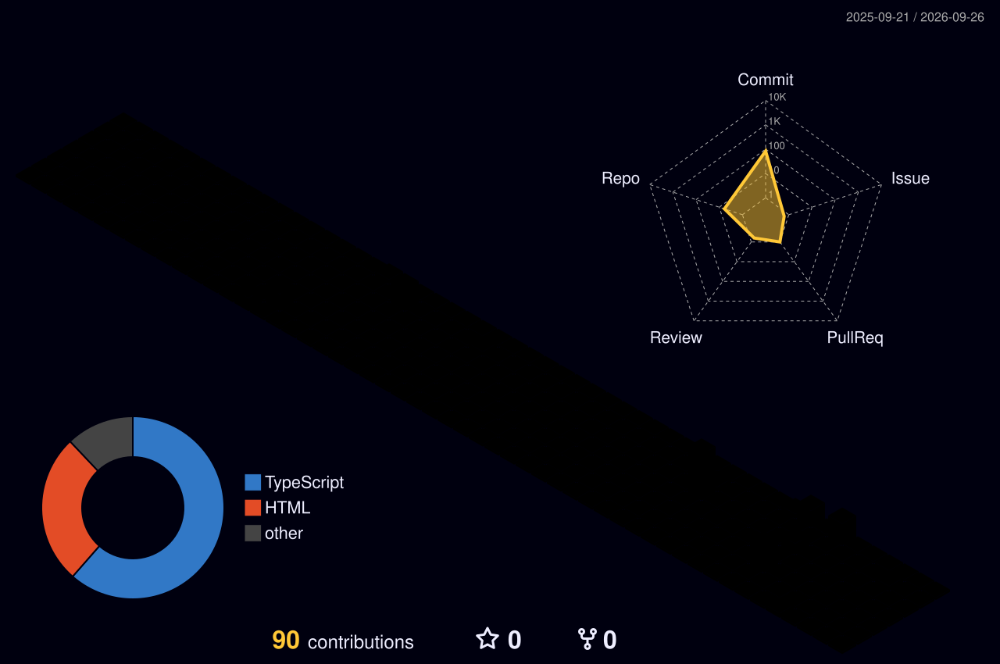

<!-- Animated Waving Header -->

  <!-- Dynamic Typing Console -->
  

 

<!-- Activity Trophies -->

  

 

<!-- Elite Stat Trackers -->

  
  

 

<!-- Animated Tech Arsenal -->
<h2 align="center">⚡ Supreme Tech Arsenal</h2>

  

 

<!-- 3D Contribution Metropolis (Requires GitHub Action in Step 3) --
<h2 align="center">🏙️ Contribution Metropolis</h2>

  

<!-- Animated Footer -->

